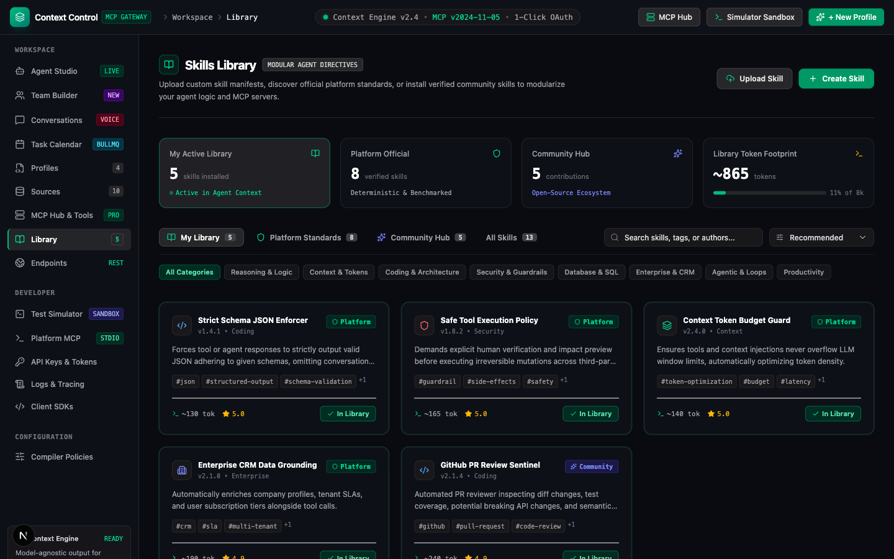

# Context Control Multitenant SaaS Agentic Platform

An enterprise-grade, multi-tenant SaaS platform for autonomous AI agent teams, persistent conversation threads, scheduled deferred task execution, and Hub-and-Spoke Model Context Protocol (MCP) tool integration.

The platform completely abstracts away cloud infrastructure (AWS Lambda, BullMQ Redis queues, EventBridge schedulers, and Supabase `pgvector` databases) into an intuitive, high-performance UI dashboard for tenants.

---

## 🌟 Comprehensive Tenant Capabilities

- 🤖 **Agent & Team Studio:** Interactive Agent Session Studio and visual Team Builder with LangGraph hierarchical supervisor routing.
- 💬 **Persistent Threads & Voice AI Engine:** Supabase PostgreSQL conversation state checkpointing paired with **ElevenLabs Conversational Voice AI** and **Twilio Phone Telephony**.
- 📅 **Deferred Task Calendar View:** BullMQ & AWS EventBridge powered target-time job scheduling with live calendar visualization and countdown triggers.
- 🔌 **MCP Tool Hub & Gateway:** Pre-built Hub-and-Spoke tool connections (Gmail, Slack, Google Calendar, Cloudflare, Supabase Vector, and Custom MCPs) with zero credential leakage.
- 🧠 **Context Profiles & RAG Knowledge:** Token-budgeted context compiler, system instruction profiles, tenant brand voice enforcement, and `pgvector` 1536d semantic memory stores.
- ⚡ **Endpoints API & Live cURL Generator:** Dedicated tenant REST API endpoints (`/api/v1/*`) and interactive cURL request builder.
- 🛡️ **Multi-Tenant BYOK Vault:** AES-256-GCM encrypted credential storage and hardware-level Row-Level Security (RLS) database isolation.

---

## 📱 SaaS Tenant Workspace User Guide

---

### 1. Agent Session Studio (Single Agent)

#### 🎯 Overview & Strategic Purpose
The **Agent Session Studio** serves as the primary real-time operational interface for single autonomous agents. It bridges high-level tenant prompt inputs with dynamic LLM reasoning, live tool call execution, and token-budgeted context resolution. Rather than relying on simple stateless chat widgets, the Agent Studio provides full visibility into the agent's internal thought process, active context profile parameters, and intermediate tool execution outputs.

#### ⚡ Comprehensive Feature Breakdown & Architecture
- **Real-Time Thought & Tool Execution Streaming:** As the agent evaluates user instructions, every intermediate reasoning step, JSON schema validation, and tool call payload is streamed live to the UI interface. Tenants can expand individual execution cards to inspect raw tool arguments (e.g. searching Gmail threads or querying CRM databases) and response status codes.
- **Dynamic Context Profile Toggling:** Tenants can dynamically select pre-configured **Context Profiles** from a header dropdown. Switching profiles instantly updates the agent's core system instructions, tenant brand voice, customer loyalty tier rules, and token allocation limits without restarting the chat session.
- **System Instruction Overrides:** Offers an inline developer drawer allowing tenants to inject temporary system instruction overrides on the fly. This enables testing specific edge-case prompts, tone adjustments, or constraint guardrails before committing them to a production profile blueprint.
- **Persistent State Checkpointing:** Every message, thought step, and tool call result is serialized into binary checkpoints stored in Supabase PostgreSQL (`public.checkpoints`). Sessions can be paused, resumed, or audited at any time with guaranteed state continuity.
- **Token Budget Monitoring:** Real-time token usage meter displays prompt tokens, completion tokens, and context window utilization, preventing unexpected API cost spikes.

#### 📖 Step-by-Step UI How-To-Use Guide
1. Select **Agent Studio** from the left navigation menu under the *Workspace* section.
2. In the top bar header, click the **Context Profile** dropdown selector to choose an active agent profile (e.g., *Customer Support Lead*, *Sales Outbound Representative*, or *Technical Auditor*).
3. Type your operational instructions into the prompt input drawer at the bottom of the studio screen and press **Send** or `Enter`.
4. Observe the live execution waterfall:
   - Green accordion headers indicate successful tool calls (e.g. `gmail_fetch_threads`).
   - Yellow headers highlight pending or executing actions.
   - Red headers indicate caught errors or fallback triggers.
5. Click on any tool call accordion card to view raw JSON parameters, response headers, and latency metrics.
6. To test custom instructions, click **System Overrides**, modify the system prompt text, and submit a new message turn.

---

### 2. Team Builder (Multi-Agent Supervisor Graphs)

#### 🎯 Overview & Strategic Purpose
The **Team Builder** allows tenants to construct collaborative multi-agent teams using hierarchical supervisor topologies. Complex business workflows often exceed the capabilities of a single monolithic agent persona. The Team Builder solves this by establishing a central **Supervisor Agent** that acts as an intelligent router, decomposing incoming multi-step tasks and delegating sub-tasks to specialized worker agents (e.g. *Research Specialist*, *Copywriter*, *Billing Auditor*, *Incident Dispatcher*).

#### ⚡ Comprehensive Feature Breakdown & Architecture
- **Hierarchical Routing Topologies:** Incorporates LangGraph-style state machine routing patterns (`supervisor_router`, `sequential_pipeline`, `consensus`). The supervisor agent evaluates incoming user turns and routes control to worker nodes based on their assigned operational roles and tool whitelists.
- **Specialized Worker Node Assignment:** Tenants can create and attach an unlimited number of worker nodes to a team blueprint. Each worker node receives dedicated system instructions, an avatar icon, and a strictly scoped whitelist of allowed MCP tools (e.g. restricting a Billing Clerk to Stripe tools while granting a Copywriter access to Gmail and Slack).
- **Conditional Fallback & Escalation Matrix:** Every team blueprint includes an automated fallback policy matrix (`edgeCasePolicies`). If a primary worker's tool action fails (such as an email delivery bounce or CRM API rate limit), the state graph automatically traverses conditional edges to trigger high-priority fallback actions, including automated **ElevenLabs Voice Calls** or Slack emergency alerts.
- **Visual Topology Tree:** Interactive canvas displays the team structure, routing strategies, active worker nodes, allocated MCP tools, and assigned capability skills.

#### 📖 Step-by-Step UI How-To-Use Guide
1. Navigate to **Team Builder** from the workspace sidebar.
2. Click **Create New Team** or click an existing blueprint card (e.g. *Front Desk Automation Team*, *Night Audit Team*).
3. In the team configuration modal:
   - Enter the **Team Name** and select the **Routing Strategy** (*Supervisor Router*, *Sequential Pipeline*, or *Consensus*).
   - Write the **Supervisor Prompt** specifying corporate routing rules (e.g., *"Route billing and invoice inquiries to the Billing Clerk; route technical bugs to the Database Auditor"*).
4. Click **Add Worker Node** to attach specialist agents:
   - Specify the **Worker Name** (e.g., *CRM Specialist*) and **Role** (e.g., *Lead Enrichment*).
   - Input dedicated **System Instructions** for the worker.
   - Select whitelisted **MCP Tools** from the tool selector drawer (e.g. `crm.add_lead`, `slack_post_message`).
5. Click **Deploy Team Graph** to make the multi-agent team blueprint available for live studio sessions, API endpoints, and scheduled deferred calendar tasks.

---

### 3. Conversations & Live Voice Conference (Postgres Threads, ElevenLabs & Twilio)

#### 🎯 Overview & Strategic Purpose
The **Conversations** module provides full auditability and management across all past and active agent communication threads. It houses the platform's **Live Voice Conference Engine**, enabling agents to perform automated outbound telephone calls and answer inbound calls over standard PSTN phone lines using **ElevenLabs Conversational AI** and **Twilio Telephony**.

#### ⚡ Comprehensive Feature Breakdown & Architecture
- **Postgres Persistent Thread Audit:** Displays thread execution sessions stored in Supabase PostgreSQL (`public.thread_instances` and `public.checkpoints`). Tenants can inspect exact turn-by-turn message logs, token consumption per turn, and timestamped tool execution records.
- **ElevenLabs Speech Synthesis Integration:** Outbound voice calls utilize ElevenLabs low-latency conversational speech synthesis models, delivering natural human-like voice tone, emotion inflection, and custom accent selection.
- **Twilio Telephony & PSTN Trunking:** Manages direct phone call dispatch and phone number provisioning via Twilio. Supports automated outbound calling for urgent escalations, appointment reminders, and lead follow-ups.
- **Real-Time Audio & Text Transcript Logs:** Automatically transcribes voice call conversations into text transcripts and stores call recordings. Tenants can review full transcripts, play back call audio, and analyze caller sentiment directly in the UI.
- **Multi-Tenant RLS Isolation:** All thread records and call transcripts enforce strict tenant isolation via Postgres session variable `app.current_tenant_id`.

#### 📖 Step-by-Step UI How-To-Use Guide
1. Select **Conversations** from the left navigation menu under *Workspace*.
2. Browse the thread list or use the search bar to filter by thread ID, customer contact name, or date range.
3. Click any thread row to view its full conversation history, inspect LLM reasoning steps, and review tool call payloads.
4. **To Dispatch a Live Voice Call:**
   - Click the **Trigger Voice Call** button at the top of the view.
   - Enter the target recipient phone number in E.164 format (e.g. `+15554389021`).
   - Select the **Voice Agent Persona** and voice style (e.g. *Professional Female*, *Executive Male*).
   - Enter the **Call Script / Operational Goal** (e.g. *"Verify invoice #4029 and confirm payment approval"*).
   - Click **Dispatch Call**.
5. Monitor call status indicators (*Initiating*, *Ringing*, *In Progress*, *Completed*).
6. Once completed, click the **Audio Transcript** button to review the full text transcript and listen to the call audio recording.

---

### 4. Task Calendar & Deferred Queue View (BullMQ & EventBridge)

#### 🎯 Overview & Strategic Purpose
The **Task Calendar** view provides a visual timeline and scheduling dashboard for deferred background agent tasks. Standard serverless web applications suffer from strict HTTP execution timeouts (10 to 60 seconds). The Task Calendar eliminates these limitations by offloading delayed agent jobs to a durable **BullMQ Redis Queue** and **AWS EventBridge Target-Time Scheduler**.

#### ⚡ Comprehensive Feature Breakdown & Architecture
- **Target-Time Countdown Triggers:** Enables tenants to schedule agent tasks to execute at exact future ISO 8601 timestamps (e.g. `at(2026-09-28T14:00:00Z)`). Single-use AWS EventBridge rules trigger background workers at the target time with zero idle compute costs.
- **BullMQ Redis Queue Durability:** Scheduled jobs are enqueued into BullMQ sorted sets and atomic Redis journals (`durable_queue_journal.json`). If a worker container recycles or restarts, all scheduled executions survive without job loss.
- **Interactive Monthly & Weekly Calendar Timelines:** Visual calendar view displays upcoming scheduled tasks, active execution countdown timers, and historical task outcomes.
- **Fallback & Edge-Case Policy Matrix:** Every scheduled task incorporates a configurable fallback matrix. If a primary tool action bounces during execution, the queue engine automatically triggers secondary actions, retries, or voice call escalations.
- **Asynchronous Job Management:** Allows tenants to trigger pending tasks immediately for testing or cancel delayed executions with a single click.

#### 📖 Step-by-Step UI How-To-Use Guide
1. Click **Task Calendar** in the workspace sidebar.
2. Toggle between the **Calendar View** (interactive monthly timeline) and **List View** (tabular job status table).
3. **To Schedule a New Deferred Task:**
   - Click the **Schedule Deferred Task** button.
   - Enter the **Task Title** (e.g. *Nightly Lead Quality Audit*) and **Operational Instructions**.
   - Select the target **Execution Date & Time** using the date-time picker.
   - Select the **Target Agent or Team Graph** to perform the work.
   - Choose allowed **MCP Tools** from the whitelist drawer.
   - Configure **Fallback Policies** (*Escalate to Voice Call*, *Retry with Exponential Backoff*, or *Abort*).
   - Click **Schedule Task**.
4. View the newly created task card on the calendar timeline.
5. To test execution immediately, click on the task card and select **Trigger Now**. To cancel a pending job, click **Cancel Task**.

---

### 5. Context Profiles Engine

#### 🎯 Overview & Strategic Purpose
The **Context Profiles** view allows tenants to build and manage fine-tuned context templates that govern agent behavior across sessions, API endpoints, and scheduled tasks. Context profiles encapsulate system prompts, corporate brand voice, customer loyalty tier rules, and token budget allocations into reusable blueprints.

#### ⚡ Comprehensive Feature Breakdown & Architecture
- **Priority-Based Token Trimming:** Enforces hard token limits (e.g. 4,096 or 8,192 tokens). When prompt context threatens to exceed limits, the compiler automatically trims lower-priority sections (such as older conversation history) while preserving core system instructions and active tool schemas.
- **Tenant Brand Voice Injection:** Standardizes agent communications across chat and voice channels by injecting tenant-specific tone rules, brand guidelines, and forbidden word lists.
- **Multi-Persona Profiles:** Tenants can maintain distinct profiles tailored for specific operational use cases, such as *Customer Support*, *Sales Outreach*, *DevOps Auditor*, and *Executive Summaries*.

#### 📖 Step-by-Step UI How-To-Use Guide
1. Select **Profiles** from the left navigation bar under *Workspace*.
2. Click **Create Profile** or select an existing profile card to edit.
3. Configure profile settings:
   - **Profile Name** and **Description**.
   - **System Prompt Instructions** defining core agent behavior and boundaries.
   - **Brand Voice & Tone** guidelines.
   - **Max Token Budget** limit (e.g. `8192` tokens).
4. Click **Save Profile** to make the context profile instantly available across the Agent Studio, Team Builder, and REST API endpoints.

---

### 6. Knowledge Sources & Memory (RAG Ingestion & Supabase pgvector)

#### 🎯 Overview & Strategic Purpose
The **Sources** view manages tenant Retrieval-Augmented Generation (RAG) knowledge bases and long-term semantic memories stored in Supabase `pgvector`. Agents query indexed knowledge sources automatically during conversation turns to provide accurate, factual responses based on company documentation.

#### ⚡ Comprehensive Feature Breakdown & Architecture
- **Document & URL Knowledge Ingestion:** Upload PDF files, text documents, or submit website URLs for automated text extraction, chunking, and vector embedding.
- **Supabase pgvector Embeddings:** Stores high-dimensional vector embeddings (1536-dimensional) in Supabase PostgreSQL (`public.memory_store`) with fast cosine similarity search indexes (`idx_memory_store_tenant_thread`).
- **Hardware-Level Tenant Isolation:** Enforces strict Row-Level Security (RLS) policies to guarantee that knowledge fragments and vector embeddings are completely isolated between tenant organizations.

#### 📖 Step-by-Step UI How-To-Use Guide
1. Click **Sources** in the left sidebar menu.
2. Click **Ingest New Source**.
3. Choose **File Upload** (PDF, TXT, Markdown) or **Website URL**.
4. Click **Process & Embed**. The platform chunking engine will extract text and store vector embeddings in `public.memory_store`.
5. Use the **Semantic Search Sandbox** field to submit query terms and verify retrieved document fragments and similarity scores.

---

### 7. MCP Hub & Tools Protocol (Hub-and-Spoke Integration)

#### 🎯 Overview & Strategic Purpose
The **MCP Hub** is the central control panel for Model Context Protocol (MCP 2024-11-05 JSON-RPC 2.0) tool integrations. It provides one-click connectivity for pre-authenticated tool spokes (Gmail, Slack, Google Calendar, Cloudflare, Supabase Vector) and allows tenants to register custom stdio or SSE MCP tool servers.

#### ⚡ Comprehensive Feature Breakdown & Architecture
- **Zero Credential Exposure:** API keys and OAuth2 refresh tokens are encrypted using AES-256-GCM inside the tenant vault (`public.tenant_vault`). Credentials are decrypted exclusively inside the MCP gateway proxy and are never exposed to LLM context windows or client browsers.
- **Pre-Authenticated Tool Spokes:** One-click integration for popular enterprise spokes:
  - `gmail_send_message` & `gmail_fetch_threads`
  - `slack_post_message` & `slack_post_incident_alert`
  - `calendar_list_events` & `calendar_create_event`
  - `cloudflare_verify_token` & `supabase_vector_query`
- **Custom Tool Transport Support:** Connect custom MCP tool servers via stdio commands or SSE HTTP endpoints.

#### 📖 Step-by-Step UI How-To-Use Guide
1. Select **MCP Hub & Tools** from the sidebar menu under *Workspace*.
2. Toggle active tool spokes on or off.
3. Click **Configure Credentials** on any spoke card to enter required API keys or authorize OAuth connections.
4. Click **Test Tool Connection** to send an RPC ping and verify tool readiness.

---

### 8. Skills Library Registry

#### 🎯 Overview & Strategic Purpose
The **Library** view manages modular skill packages (`SKILL.md`) that extend agent capabilities with domain-specific workflows, multi-step heuristics, and specialized API automation kits.

#### ⚡ Comprehensive Feature Breakdown & Architecture
- **Pre-Built Skill Packages:** Pre-configured skill kits for CRM lead enrichment, security audits, calendar management, and database query optimization.
- **Custom Skill Import:** Import custom skill markdown definitions containing YAML frontmatter metadata and step-by-step execution scripts.
- **One-Click Agent Skill Assignment:** Enable or disable individual skills per agent profile with a single UI toggle switch.

#### 📖 Step-by-Step UI How-To-Use Guide
1. Navigate to **Library** in the workspace sidebar.
2. Browse the skill catalog cards or click **Upload Custom Skill**.
3. Toggle the status switch on any skill card to make it immediately available to your Agent Studio and Team Builder graphs.

---

### 9. Endpoints API & Live cURL Generator

#### 🎯 Overview & Strategic Purpose
The **Endpoints** view provides interactive documentation and a live cURL request generator for the tenant REST API (`/api/v1/*`). It enables headless integration into external webhooks, custom frontends, and mobile apps.

#### ⚡ Comprehensive Feature Breakdown & Architecture
- **Interactive cURL Generator:** Live request builder for `/api/v1/tasks`, `/api/v1/schedule_task`, `/api/v1/conversations`, and `/api/v1/context/resolve`.
- **Pre-Populated Auth Headers:** Automatically pre-populates request headers with your active workspace tenant ID (`x-tenant-id`) and API authorization key.
- **Multi-Language Snippets:** Copy-and-paste code snippets available in cURL, JavaScript (Fetch), Python (Requests), and Go.

#### 📖 Step-by-Step UI How-To-Use Guide
1. Click **Endpoints** in the sidebar navigation.
2. Select an API endpoint from the route selector list.
3. Fill in request body fields in the interactive form to update the cURL command in real-time.
4. Click **Copy cURL** to copy the command or click **Execute Request** to test the API route directly inside the browser.

---

### 10. Test Simulator & Time-Travel Sandbox

#### 🎯 Overview & Strategic Purpose
The **Test Simulator** is a sandbox testing playground designed to evaluate agent graph state machine transitions, simulate tool failures, and verify scheduled task execution without modifying production database records.

#### ⚡ Comprehensive Feature Breakdown & Architecture
- **Time-Travel Execution:** Fast-forward target-time countdown timers to trigger deferred background tasks immediately in a simulated state environment.
- **Simulated Tool Failure Injection:** Test edge-case escalation graphs by injecting simulated tool outages (e.g. Gmail rate limit HTTP 429) to verify that fallback voice calls trigger as expected.
- **Waterfall Step Inspector:** Detailed visual trace showing step-by-step state transitions, execution timings, and payload diffs.

#### 📖 Step-by-Step UI How-To-Use Guide
1. Select **Test Simulator** under the *Developer* section of the sidebar.
2. Select a pre-configured scenario or enter custom task input parameters.
3. Toggle **Simulate Primary Tool Failure** to test fallback policy handling.
4. Click **Run Simulation** and review the step-by-step waterfall execution trace.

---

### 11. Platform MCP Controller (Stdio/SSE)

#### 🎯 Overview & Strategic Purpose
The **Platform MCP** view manages external host connections (such as Claude Desktop, Cursor IDE, Windsurf, and local CLI agents) to your tenant workspace. It exposes a standardized MCP server endpoint (`/api/mcp/platform`).

#### ⚡ Comprehensive Feature Breakdown & Architecture
- **Stdio & SSE Transport Adapters:** Complies with Model Context Protocol (MCP 2024-11-05 JSON-RPC 2.0) transport standards.
- **11 Direct Controller Tools:** Exposes 11 platform controllers allowing external host applications to create team blueprints, schedule deferred tasks, inspect database schemas, and view vault status.
- **Automated Configuration Generator:** Generates copy-and-paste JSON configurations for `claude_desktop_config.json` and Cursor `.cursor/mcp.json`.

#### 📖 Step-by-Step UI How-To-Use Guide
1. Navigate to **Platform MCP** in the workspace sidebar.
2. Select your client application tab (*Claude Desktop*, *Cursor*, *Windsurf*, or *cURL*).
3. Click **Copy Config JSON**.
4. Paste the configuration snippet into your local client's MCP configuration file and restart the client to access all 11 platform controller tools.

---

### 12. API Keys & BYOK Security Vault

#### 🎯 Overview & Strategic Purpose
The **API Keys & Security** view governs workspace access tokens and tenant Bring Your Own Key (BYOK) credentials. All third-party secrets are stored using AES-256-GCM encryption in the tenant vault (`public.tenant_vault`) and isolated using PostgreSQL Row-Level Security (RLS).

#### ⚡ Comprehensive Feature Breakdown & Architecture
- **AES-256-GCM BYOK Vault:** Encrypts API keys and OAuth tokens before writing to PostgreSQL, maintaining zero plaintext credential storage.
- **Short-Lived Token Minter:** Generate client-scoped context tokens for embedding agent chat widgets in web applications.
- **Postgres Row-Level Security (RLS):** Hardware-level tenant isolation enforced via `current_setting('app.current_tenant_id')`.

---

## 🏗️ Managed Technical Infrastructure (Under the Hood)

While all daily operations are managed seamlessly through the UI workspace, the platform is backed by enterprise-grade cloud infrastructure:

- **Next.js 15 Full-Stack UI & API:** React 19 full-stack application layer deployed on AWS.
- **BullMQ & Redis Queue:** Durable background task queue engine handling delayed jobs and crash recovery journals.
- **AWS EventBridge Scheduler:** Serverless target-time trigger engine with automatic single-use schedule cleanup.
- **Supabase PostgreSQL & `pgvector`:** Durable state checkpointing (`PostgresSaver`) and vector memory store with hardware-level RLS policies.
- **ElevenLabs & Twilio Telephony:** Low-latency conversational voice synthesis engine integrated with direct PSTN phone call dispatch.

---

## 📜 License

Distributed under the MIT License.
