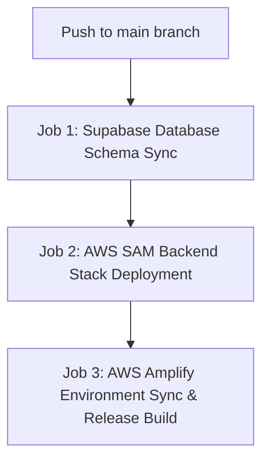

# Production Environment Variables & GitHub Secrets

This document lists all required environment variables, secrets, and AWS GitHub OIDC credentials for deploying **Context Control** to **AWS Amplify** and running backend SAM / database migration jobs via **GitHub Actions**.

---

## 🔐 1. GitHub Repository Secrets & Variables Matrix

Add these secrets and variables in your GitHub Repository under **Settings -> Secrets and variables -> Actions**.

### 🔑 GitHub Actions Secrets (`secrets.*`)
| Secret Name | Description | Example / Format |
| :--- | :--- | :--- |
| `AWS_ROLE_TO_ASSUME` | IAM Role ARN configured for GitHub Actions OIDC federation | `arn:aws:iam::123456789012:role/GitHubActionsAmplifyDeployRole` |
| `AMPLIFY_APP_ID` | AWS Amplify App ID (multitenant-agent-app, us-east-2) | `d1iqgqn47ob84d` |
| `SUPABASE_ACCESS_TOKEN` | Supabase Personal Access Token (for CLI migrations) | `sbp_...` |
| `SUPABASE_PROJECT_ID` | Supabase Project Reference ID | `zguuksjxomrfhkzpubgx` |
| `NEXT_PUBLIC_SUPABASE_URL` | Public Supabase project URL | `https://zguuksjxomrfhkzpubgx.supabase.co` |
| `NEXT_PUBLIC_SUPABASE_ANON_KEY` | Public Supabase anonymous API key | `eyJhbGciOiJIUzI1Ni...` |
| `SUPABASE_SERVICE_ROLE_KEY` | Supabase Service Role Key (Server-only admin key) | `eyJhbGciOiJIUzI1Ni...` |
| `STRIPE_SECRET_KEY` | Stripe Production Secret Key | `sk_live_...` or `sk_test_...` |
| `STRIPE_WEBHOOK_SECRET` | Stripe Webhook Signing Secret | `whsec_...` |
| `AWS_KMS_KEY_ID` | AWS KMS Key ARN or Alias for BYOK Envelope Encryption | `alias/context-control-tenant-secrets` |
| `SUPABASE_DB_PASSWORD` | Database password used by `supabase link` / `db push` in CI (required; the sync job fails without it) | — |
| `CLIENT_TOKEN_SIGNING_KEY` | Base64 of a P-256 PKCS#8 PEM used to sign and verify client tokens on every instance. Required in production. Generate: `openssl genpkey -algorithm EC -pkeyopt ec_paramgen_curve:P-256 \| base64 \| tr -d '\n'` | `LS0tLS1CRUdJTi...` |
| `MCP_SMOKE_TEST_KEY` | Optional. A read-only `ctx_live_` key used by the post-deploy smoke test to run an authenticated `initialize` | `ctx_live_...` |

### ⚙️ GitHub Actions Variables (`vars.*`)
| Variable Name | Description | Default Value |
| :--- | :--- | :--- |
| `AWS_REGION` | AWS Region for Amplify, KMS, and SAM deployment | `us-east-2` |
| `DEMO_MODE` | Server-side mock mode flag | `false` |
| `NEXT_PUBLIC_DEMO_MODE` | Client-side mock mode flag | `false` |
| `ENABLE_VOICE_CALLS` | Feature flag for Twilio/ElevenLabs voice calls | `false` |

---

## 🛠️ 2. AWS Amplify Environment Variable Synchronization

When deploying Next.js to AWS Amplify, environment variables must be registered in Amplify so the SSR build and Lambda edge functions can access them.

Our GitHub Actions workflow (`.github/workflows/deploy-stack.yml`) automatically syncs these secrets to your AWS Amplify app using the AWS CLI command:

```bash
aws amplify update-app --app-id "$APP_ID" --environment-variables \
  NEXT_PUBLIC_SUPABASE_URL="$NEXT_PUBLIC_SUPABASE_URL" \
  NEXT_PUBLIC_SUPABASE_ANON_KEY="$NEXT_PUBLIC_SUPABASE_ANON_KEY" \
  SUPABASE_SERVICE_ROLE_KEY="$SUPABASE_SERVICE_ROLE_KEY" \
  STRIPE_SECRET_KEY="$STRIPE_SECRET_KEY" \
  STRIPE_WEBHOOK_SECRET="$STRIPE_WEBHOOK_SECRET" \
  AWS_KMS_KEY_ID="$AWS_KMS_KEY_ID" \
  DEMO_MODE="false" \
  NEXT_PUBLIC_DEMO_MODE="false" \
  ENABLE_VOICE_CALLS="false"
```

---

## 🚀 3. GitHub Actions Pipeline Architecture

The `.github/workflows/deploy-stack.yml` pipeline consists of 3 sequential jobs:



1. **Job 1: Supabase Schema Sync (`supabase-db-sync`)**
   - Installs Supabase CLI.
   - Runs `supabase link` and `supabase db push` to apply pending migrations.

2. **Job 2: AWS SAM Backend Stack Deployment (`backend-aws-sam-deploy`)**
   - Assumes AWS IAM OIDC Role.
   - Runs `sam build` and `sam deploy` to provision/update AWS SQS queues, EventBridge Scheduler execution roles, and worker Lambdas defined in `template.yaml`.

3. **Job 3: AWS Amplify Frontend Deployment (`frontend-aws-amplify-deploy`)**
   - Syncs GitHub Action Secrets to Amplify App Environment Variables via AWS CLI.
   - Triggers `aws amplify start-job --job-type RELEASE` to compile and deploy the Next.js App Router frontend.

---

## 🔒 4. AWS IAM OIDC Trust Policy Setup

To allow GitHub Actions to deploy to AWS without long-lived access keys, create an IAM Role with this Trust Policy:

```json
{
  "Version": "2012-10-17",
  "Statement": [
    {
      "Effect": "Allow",
      "Principal": {
        "Federated": "arn:aws:iam::YOUR_AWS_ACCOUNT_ID:oidc-provider/token.actions.githubusercontent.com"
      },
      "Action": "sts:AssumeRoleWithWebIdentity",
      "Condition": {
        "StringEquals": {
          "token.actions.githubusercontent.com:aud": "sts.amazonaws.com"
        },
        "StringLike": {
          "token.actions.githubusercontent.com:sub": "repo:quetzal-rivas/Multitenant-saas-agentic-platform:*"
        }
      }
    }
  ]
}
```
